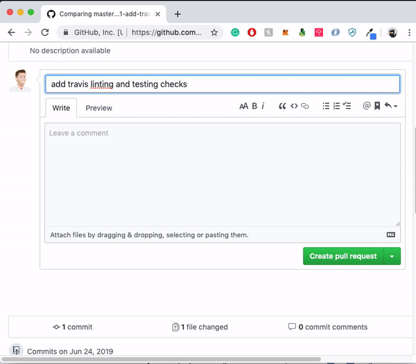

**[Setup](#setup)** | **[Contributing](#contributing)** | **[License](#license)**

# Pull Request Issue Connector

> A GitHub App built with [Probot](https://github.com/probot/probot) that connects issues to Pull Requests based off feature branch naming conventions

The Pull Request Issue Connector bot will identify pull requests from branches that denote an issue number
and will automatically cross reference the issue within the pull request. If you forgot to add the issue number
to your pull request message the bot will automatically add the cross reference for you.



The only requirement for the bot to be able to find your issue is for your branch name to start with the issue number
you would like attached to your pull request.

e.g. - Say we want to open a pull request to resolve `Issue #1: Add Travis`

The following are valid branch names that the bot will understand, `1`, `1-travis-build`, `1-{any string}` and automatically handle assignment for us

## Setup

```sh
# Install dependencies
npm install

# Run the bot
npm start

# Open the following link in the browser to install the bot on a GitHub repository
http://localhost:3000
```

## Contributing

If you have suggestions for how issue-connector could be improved, or want to report a bug, open an issue! We'd love all and any contributions.

For more, check out the [Contributing Guide](CONTRIBUTING.md).

## License

[ISC](LICENSE) © 2019 Jon Gear <askjon@jongear.io>
